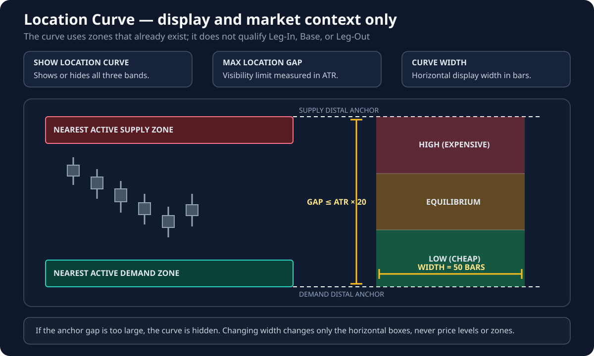

# Location Curve

!!! info "Applies to: DISPLAY AND MARKET CONTEXT only"
    These settings do not qualify the **LEG-IN**, **BASE**, or **LEG-OUT**, and they do not create or resize zones. They only control the Location Curve drawn from zones that already exist.

## Terms used on this page

- **Supply zone** — an area above price where selling pressure previously caused a strong departure.
- **Demand zone** — an area below price where buying pressure previously caused a strong departure.
- **Location Curve** — a visual map of where current price sits between nearby Supply and Demand.
- **ATR** — a measure of typical recent market movement.
- **High, Equilibrium, and Low** — the upper, middle, and lower thirds of the space between the selected zones.

## What the Location Curve does

The Location Curve is a market-context display. It does not create, remove, or resize Supply and Demand zones.

The indicator selects the nearest active Demand zone below price and the nearest active Supply zone above price. The range between their boundaries is divided into three equal areas:

- **High (Expensive)**
- **Equilibrium**
- **Low (Cheap)**

## Inputs

| Parameter | Default | What the trader controls |
| --- | ---: | --- |
| Show Location Curve | `true` | Shows or hides the High, Equilibrium, and Low bands. It does not affect zone detection. |
| Max. Location Gap (ATR ×) | `20` | Prevents the curve from being displayed when the selected zones are unusually far apart compared with recent movement. A lower value hides the curve more often. |
| Location Curve Width (Bars) | `50` | Changes only the horizontal width of the colored bands. It does not change prices, zone selection, or trading logic. |

## How to read it

- **High (Expensive)** suggests price is closer to the selected Supply side of the range.
- **Equilibrium** places price in the middle third.
- **Low (Cheap)** suggests price is closer to the selected Demand side.

These labels describe relative location, not an automatic buy or sell signal.

## Visual for this group

The nearest qualifying Supply and Demand zones provide the vertical anchors. The gap filter decides whether the curve may be shown, while width changes only how far the three bands extend horizontally.
