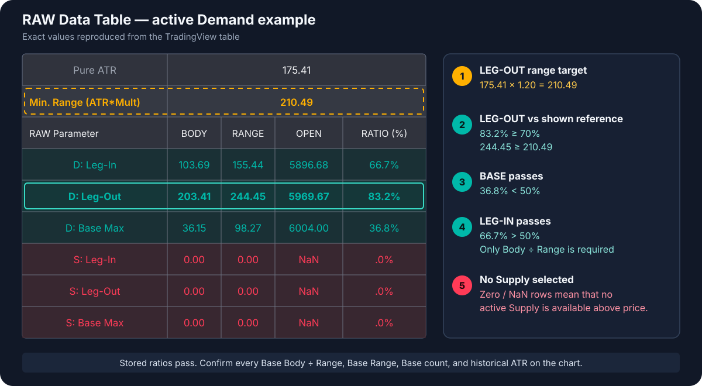

# RAW Data Table — Zone Debugging Guide

The RAW Data Table shows the stored candle measurements for the **nearest active Demand zone below price** and the **nearest active Supply zone above price**.

Enable it with **Visual Settings → Show RAW Data Table**. The table appears in the top-right corner.

## Demand example

The example contains an active Demand zone, so the three `D:` rows are populated. The Supply rows contain zeros and `NaN`, which means there is no active Supply zone available above current price.

The body and range values belong to the selected zone. `Pure ATR` and `Min. Range (ATR*Mult)` belong to the latest chart bar. The range comparison below reproduces the original detection check only when the Leg-Out is the Bar Replay endpoint; for an older zone it is a comparison with the current market reference.

## 1. Establish the Leg-Out range target

The first two rows show:

- `Pure ATR = 175.41`
- `Min. Range (ATR*Mult) = 210.49`

With the default `Min. Leg-Out Range (ATR ×) = 1.20`:

**175.41 × 1.20 = 210.49**

The Leg-Out therefore needs a complete range of at least `210.49`.

## 2. Check the Leg-Out

The `D: Leg-Out` row shows:

| BODY | RANGE | OPEN | RATIO (%) |
| ---: | ---: | ---: | ---: |
| `203.41` | `244.45` | `5969.67` | `83.2%` |

The body condition passes, and the range exceeds the reference currently shown in the table:

- Leg-Out Body Size (% of Range): `203.41 ÷ 244.45 = 83.2%`, above the default minimum of `70%`.
- Complete range: `244.45`, above the required `210.49`.

## 3. Check the Base

The `D: Base Max` row shows:

| BODY | RANGE | OPEN | RATIO (%) |
| ---: | ---: | ---: | ---: |
| `36.15` | `98.27` | `6004.00` | `36.8%` |

The displayed ratio is:

**Largest Base body ÷ that Base candle's range = 36.15 ÷ 98.27 = 36.8%**

This passes the default `Max. Base Body Size (% of Range) = 50%` because `36.8% < 50%`.

!!! note "BODY, RANGE, and OPEN in Base Max"
    `BODY`, `RANGE`, and `OPEN` all belong to the accepted Base candle with the largest body. From v2.10.6, the Base `RATIO` is that candle's `Body ÷ Range` value; it is never divided by the Leg-Out body.

Every Base candle must satisfy `Body ÷ its own Range < 50%`. The aggregate `D: Base Max` row shows one selected Base candle, so verify the other Base candles with [Candle Metrics Debug](candle-metrics-debug.md). Exactly `50%` fails.

The RAW table does not show the number of Base candles. Count them on the chart. With the current scan behavior, the default `Max. Base Candles = 4` allows up to three actual Base candles before the Leg-In must appear.

## 4. Check the Leg-In

The `D: Leg-In` row shows:

| BODY | RANGE | OPEN | RATIO (%) |
| ---: | ---: | ---: | ---: |
| `103.69` | `155.44` | `5896.68` | `66.7%` |

The Leg-In condition passes:

- Leg-In Body Size (% of Range): `103.69 ÷ 155.44 = 66.7%`, strictly above the default minimum of `50%`.

Since v2.1.0, Leg-In body size is not compared with Base body size.

## Result for this example

| Formation part | Test | Required | Example | Result |
| --- | --- | ---: | ---: | --- |
| **LEG-OUT** | Body ÷ Range | minimum `70%` | `83.2%` | **PASS** |
| **LEG-OUT** | Complete range vs shown ATR reference | minimum `210.49` | `244.45` | **PASS*** |
| **BASE MAX** | Body ÷ own range | strictly below `50%` | `36.8%` | **PASS** |
| **OTHER BASE CANDLES** | Each body ÷ its own range | strictly below `50%` | inspect each Base candle | **NOT EXPOSED IN AGGREGATE ROW** |
| **LEG-IN** | Body ÷ Range | strictly above `50%` | `66.7%` | **PASS** |

The stored Leg-Out, selected Base, and Leg-In values pass. The remaining chart checks are the other Base candles' body/range ratios, every Base range versus the Leg-Out range when that checkbox is enabled, the number and order of Base candles, and, for an older zone, the historical ATR reference.

`*` The range result reproduces the historical detection decision only when `210.49` is captured with the Leg-Out as the replay endpoint.

## Match the rows to candles on the chart

Use the `OPEN` column as the candle identifier:

- Leg-In opens at `5896.68`.
- Leg-Out opens at `5969.67`.
- The Base candle with the largest body opens at `6004.00`.

`OPEN` helps locate the candles. It is not a pass/fail condition.

## Which zone is displayed

The table is not a zone selector. On the latest chart bar it automatically displays:

- the active Demand zone nearest below current price;
- the active Supply zone nearest above current price.

Scrolling left or clicking another box does not change the selection. Pending, broken, already tested, and rejected zones are not available in this table. Use **Bar Replay** when you need the table to evaluate an earlier chart moment.

## Debug an older or missing zone

`Pure ATR` and `Min. Range (ATR*Mult)` belong to the latest chart bar. They are not the historical values of every old zone shown on the chart.

For an older or missing formation:

1. Start Bar Replay before the suspected formation.
2. Advance until its Leg-Out is the replay endpoint.
3. Record `Pure ATR`, `Min. Range (ATR*Mult)`, and the Leg-In, Base, and Leg-Out candle values.
4. Apply the visible calculations used in the example above.
5. Count the Base candles and use Candle Metrics to verify `Body ÷ Range < 50%` for each one. When `Require Base Range ≤ Leg-Out Range` is enabled, also verify that range comparison separately for every Base candle.
6. Advance one bar and check whether the zone appears and becomes the nearest active zone in the RAW table.

The table cannot display a candidate rejected before zone creation. In that case, Bar Replay and the manual candle checks are the correct debugging workflow.

Since v2.2.0, also compare the Leg-Out extreme with the original Base distal. Demand is rejected when `Leg-Out Low ≤ Base Distal`; Supply is rejected when `Leg-Out High ≥ Base Distal`. This candidate-level rejection is not exposed in the aggregate RAW table because no Zone object is created.

Since v2.3.0, native LTF Base candles can be required to satisfy `Base Range ≤ Leg-Out Range`. From v2.10.7 this rule is controlled by an enabled-by-default checkbox. The RAW Base Max row exposes only the range paired with the largest Base body, so use Candle Metrics to inspect every Base candle; a failing candidate is rejected before a Zone object exists.

For the complete detection-input reference, open [Zone Detection Settings at a Glance](all-settings.md).
