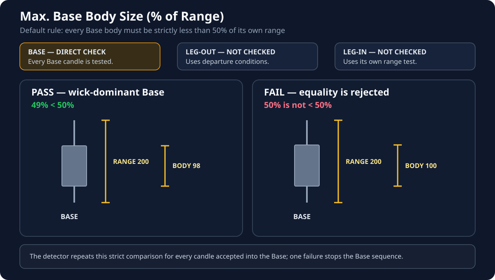

# Max. Base Body Size (% of Range)

**Default:** `50%`

!!! info "Applies to: every BASE candle"
    Every candle accepted into the Base is checked independently. There is no averaging across the Base.

    **LEG-IN and LEG-OUT — no effect:** they use their own qualification rules.

## What this setting controls

It limits how much of each Base candle's complete High-to-Low range may be occupied by its body:

**Base Body ÷ Base Range < configured percentage**

The comparison is strict. With the default `50%`, a Base candle at exactly `50%` is rejected.

## Examples at the default

| Base body | Base range | Ratio | Result |
| ---: | ---: | ---: | --- |
| `70` | `141` | `49.65%` | **PASS** |
| `70` | `140` | `50.00%` | **FAIL** |
| `70` | `100` | `70.00%` | **FAIL** |

## Interaction with Leg-Out

Every Base candle must satisfy both:

1. `Base Body ÷ Base Range < 50%` by default.
2. `Base Range ≤ Leg-Out Range` as a fixed rule.

There is no longer a Base Body ÷ Leg-Out Body test. If a candle fails either current Base test, the detector stops accepting candles into that Base and evaluates it as the possible Leg-In position.

## Visual for this setting

