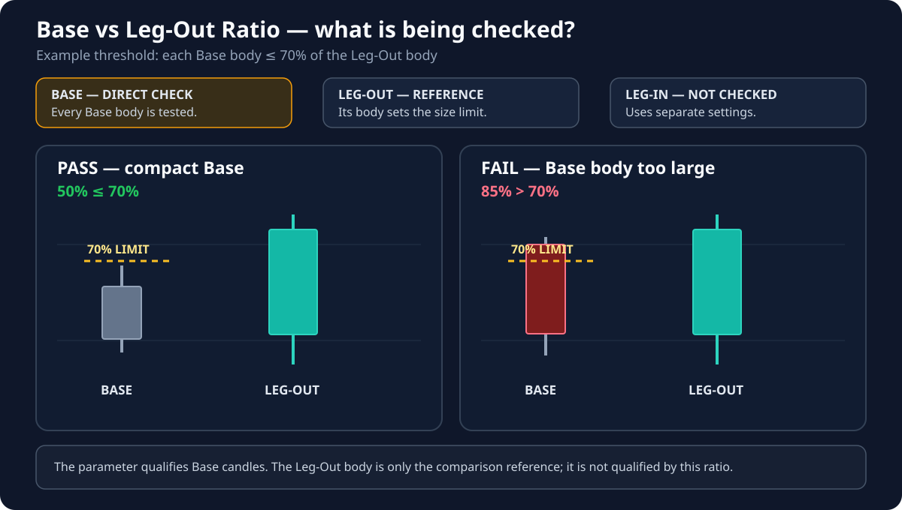

# Max. Base Body Size (% of Leg-Out)

**Default:** `70%`

!!! info "Applies to: BASE"
    **BASE — direct effect:** every base candle is checked against this setting.

    **LEG-OUT — reference only:** the Leg-Out body provides the size used for comparison, but this setting does not qualify the Leg-Out itself.

    **LEG-IN — no effect:** the Leg-In uses separate settings.

## Terms used on this page

- **Base** — the compact pause before price departs.
- **Leg-Out** — the strong departure away from the base.
- **Body** — the solid part of a candle between its open and close.

## What this setting controls

It controls how small each candle inside the **Base** must be when compared with the **Leg-Out** candle. At the default value of `70`, a base candle may have a body up to 70% of the Leg-Out body.

The purpose is to preserve a visible contrast between a quiet pause and a stronger departure.

## If you lower the value

- Bases must be tighter and calmer.
- Fewer formations qualify.
- The visual difference between the base and departure becomes clearer.

## If you raise the value

- Larger base candles are accepted.
- More zones may appear.
- Broad or noisy pauses can be classified as bases more easily.

## Visual for this setting

The **Base** body is checked directly. The **Leg-Out** body only supplies the comparison size, and the Leg-In is not tested by this parameter.
