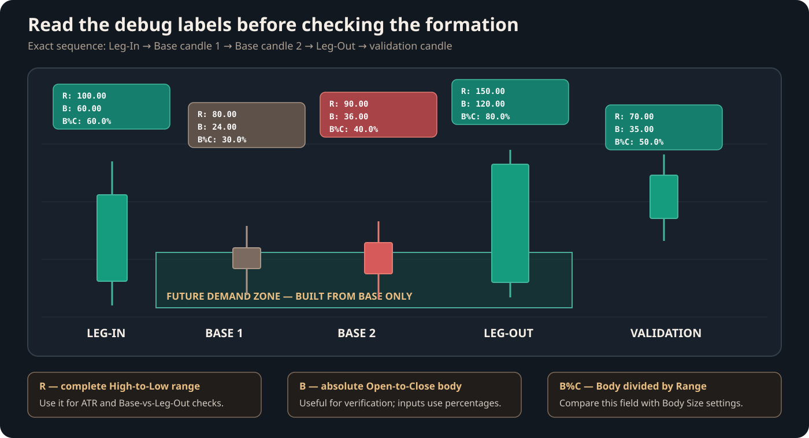
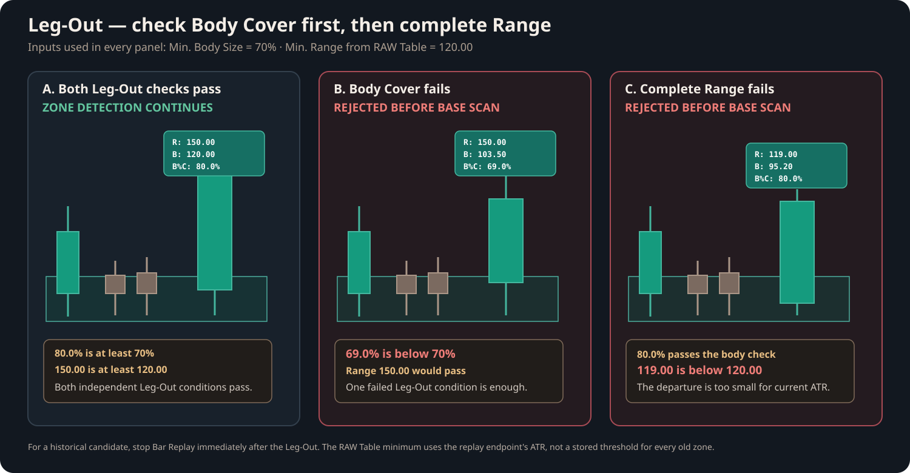
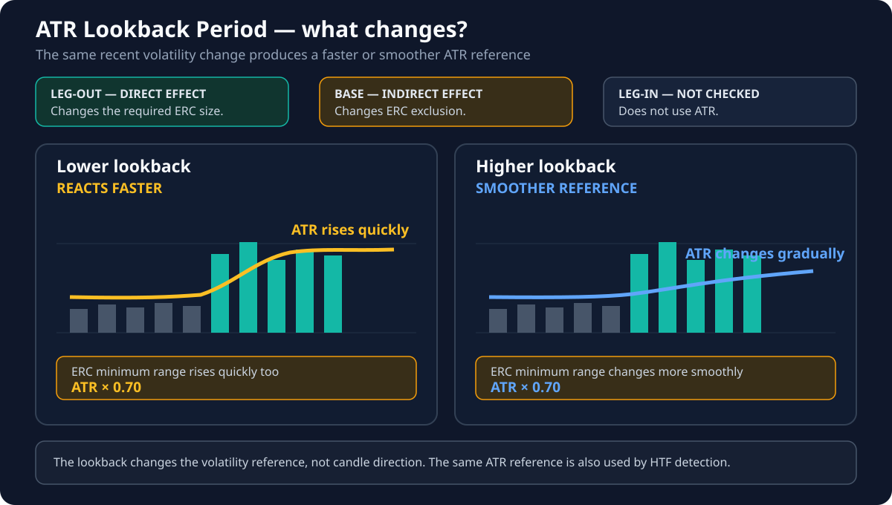
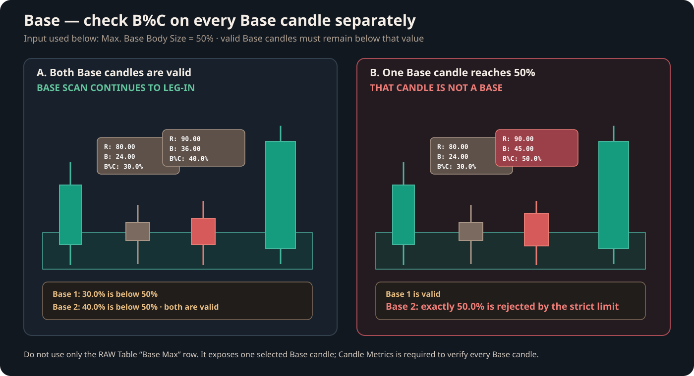
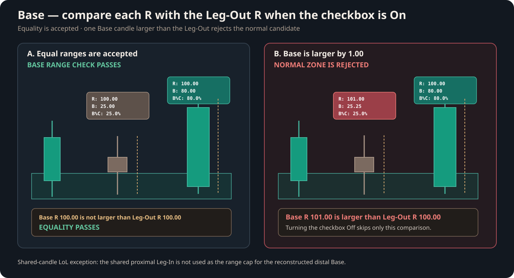
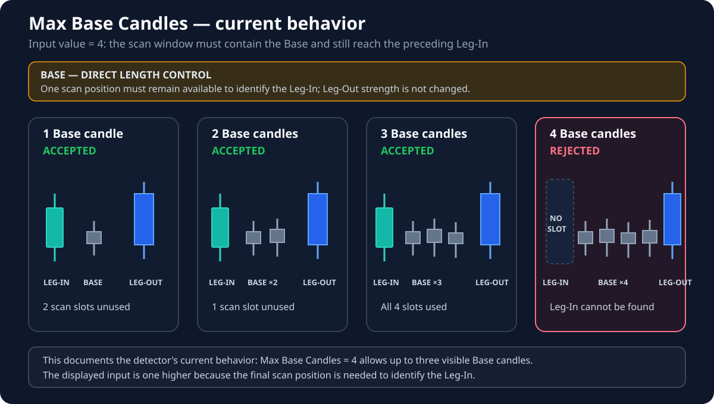
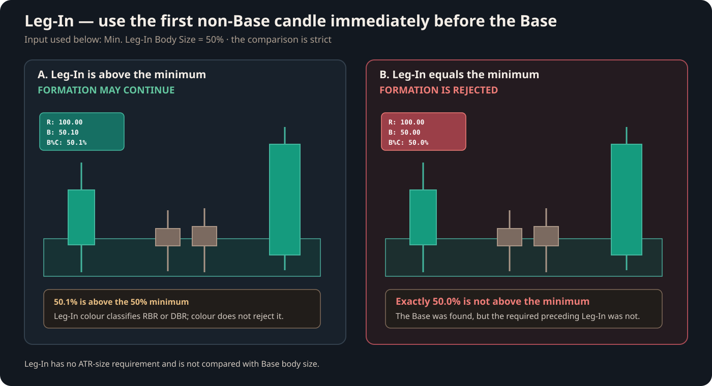
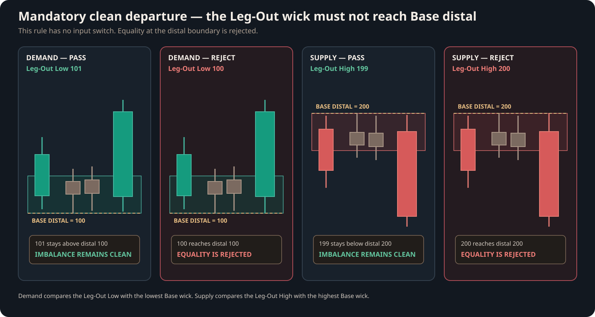
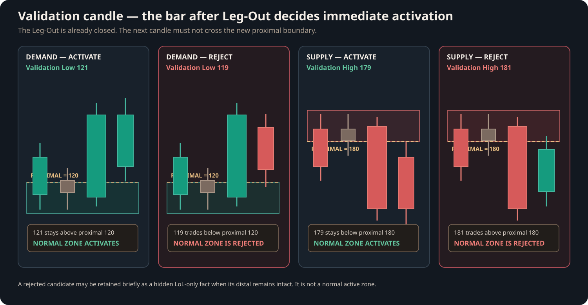

# Debugging Zone Detection with Candle Metrics

Use this workflow when a formation looks valid but Intraday does not draw a zone. Follow the checks in order. A failure near the beginning stops the detector, so later conditions are never evaluated for that candidate.

This guide documents the native LTF detector in Intraday `v2.12.1`.

## Before you start

Enable both tools:

1. **Debug → Show Candle Metrics**
2. **Visual Settings → Show RAW Data Table**

The Candle Metrics label above each candle contains:

- `R` — the complete High-to-Low range;
- `B` — the absolute Open-to-Close body;
- `B%C` — the body as a percentage of the complete range.

For a historical formation, use Bar Replay. Stop on the suspected Leg-Out candle before checking the RAW Table ATR rows. Then advance one candle to let the detector evaluate the closed Leg-Out.

## Step 1 — identify the Leg-Out

The candidate departure must have the correct direction:

- a green Rally candle for Demand;
- a red Drop candle for Supply.

The detector applies two independent Leg-Out settings.

### Check Min. Leg-Out Body Size

Compare the Leg-Out `B%C` label with **Min. Leg-Out Body Size (% of Range)**.

With the default value of `70%`, a Leg-Out with `70%` or more is accepted. A value below `70%` is rejected before the detector searches for Base candles.

### Check Min. Leg-Out Range

Compare the Leg-Out `R` label with **Min. Range (ATR*Mult)** in the RAW Table.

The complete Leg-Out range must be at least the displayed minimum. A strong body does not compensate for a range that is too small.

!!! warning "Use the correct ATR moment"
    `Pure ATR` and `Min. Range (ATR*Mult)` belong to the latest chart bar. They are not stored historical thresholds for every old zone. To reproduce an old detection decision, stop Bar Replay on the suspected Leg-Out and record the values before advancing.

## Step 2 — understand the ATR reference

**Avg. Price Range Period (Bars)** controls how many candles build the ATR reference. It does not change `R`, `B`, or `B%C` on the debug labels.

- A shorter period reacts faster to recent volatility.
- A longer period produces a smoother minimum range.
- The default period is `50` bars.

When the Body Cover and ATR range checks pass, the detector begins scanning left from the candle immediately before the Leg-Out.

## Step 3 — check every Base candle Body Cover

Every consecutive Base candle must satisfy **Max. Base Body Size (% of Range)** using its own `B%C` label.

With the default value of `50%`:

- `49.9%` is a valid Base shape;
- exactly `50.0%` is not a Base;
- any value above `50.0%` is not a Base.

One invalid candle ends the Base sequence. If at least one Base candle was already found, that first non-Base candle becomes the Leg-In candidate.

Do not rely only on the RAW Table `Base Max` row. That row exposes one accepted Base candle selected by the largest body. Use Candle Metrics to inspect every Base candle separately.

## Step 4 — compare Base Range with Leg-Out Range

When **Require Base Range ≤ Leg-Out Range** is enabled, compare every Base `R` label with the Leg-Out `R` label.

- A Base range equal to the Leg-Out range is accepted.
- A Base range larger than the Leg-Out range rejects the normal candidate.
- Turning the checkbox Off skips only this range comparison. The Base `B%C` rule still applies.

!!! note "Shared-candle LoL exception"
    During LoL-only shared-candle reconstruction, the shared proximal Leg-In is not used as a Leg-Out range cap for the reconstructed distal Base. Normal zone detection still follows the checkbox.

## Step 5 — count the Base candles

Count the consecutive valid Base candles immediately before the Leg-Out.

The current detector must find both the Base sequence and the preceding Leg-In inside the configured scan window. Therefore, with **Max. Base Candles = 4**, the current `v2.12.1` implementation accepts up to three visible Base candles. The fourth scan position must contain the Leg-In.

If all four positions are valid Base candles, the scan finishes without finding a Leg-In and no zone is created.

!!! important
    This is the exact current implementation, not a simplified interpretation of the input name.

## Step 6 — check the Leg-In

The first non-Base candle immediately before a valid Base sequence is treated as the Leg-In candidate.

Compare its `B%C` label with **Min. Leg-In Body Size (% of Range)**.

With the default value of `50%`:

- `50.1%` is accepted;
- exactly `50.0%` is rejected;
- any value below `50.0%` is rejected.

Leg-In has no ATR-size requirement and is not compared with Base body size. Its candle direction determines the formation name, but direction alone does not reject the Leg-In.

## Step 7 — check whether Leg-Out engulfed the Base imbalance

This mandatory rule has no setting.

For Demand, compare the Leg-Out Low with the lowest Base wick:

- a Leg-Out Low above Base distal is clean;
- touching or moving below Base distal rejects the candidate.

For Supply, compare the Leg-Out High with the highest Base wick:

- a Leg-Out High below Base distal is clean;
- touching or moving above Base distal rejects the candidate.

The Leg-Out may have excellent `B%C` and `R` values and still fail this clean-departure rule.

## Step 8 — check the validation candle

The detector reads the Leg-Out only after it closes. The next chart candle is the validation candle. It may touch proximal exactly, but it must not cross through that boundary.

For Demand:

- its Low may stay above or exactly at the new proximal boundary;
- moving below proximal rejects normal activation.

For Supply:

- its High may stay below or exactly at the new proximal boundary;
- moving above proximal rejects normal activation.

A candidate rejected here is not a normal active zone. When its distal remains intact, Intraday may temporarily retain it as a hidden LoL-only candidate.

## Final checklist

Use this order every time:

1. Leg-Out has the correct direction.
2. Leg-Out `B%C` satisfies the minimum Body Size.
3. Leg-Out `R` satisfies the ATR-based minimum Range.
4. Every Base candle `B%C` remains below the Base maximum.
5. When enabled, every Base `R` is no larger than Leg-Out `R`.
6. The Base count leaves a scan position for the Leg-In.
7. Leg-In `B%C` is above its minimum.
8. Leg-Out does not engulf Base distal.
9. The validation candle does not cross the new proximal boundary.

If all nine checks pass and the zone is still missing, verify that you are looking at the correct Replay moment and remember that the RAW Table shows only the nearest active Demand and Supply zones. A candidate rejected before Zone creation cannot populate the RAW Table.
