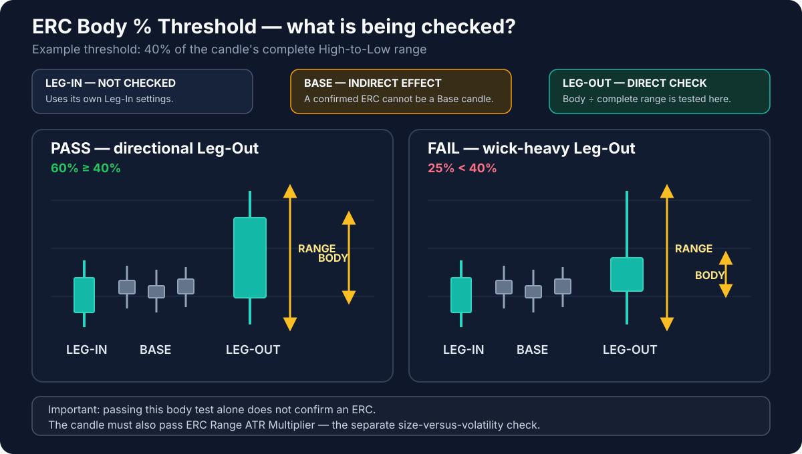

# ERC Body % Threshold

**Default:** `0.40`

!!! info "Applies to: LEG-OUT + BASE"
    **LEG-OUT — direct effect:** this setting helps decide whether the departure candle is a valid Extended Range Candle.

    **BASE — indirect effect:** a candle classified as an Extended Range Candle cannot be used as a base candle.

    **LEG-IN — no effect:** the Leg-In is qualified by its own two Leg-In settings.

## Terms used on this page

- **ERC — Extended Range Candle** — a decisive expansion candle with a meaningful body and enough size compared with recent market movement.
- **ATR — Average True Range** — a measure of how much price has typically moved over recent candles.
- **Body** — the solid part between the open and close.
- **Wicks** — the thin parts above and below the body.
- **Leg-Out** — the departure candle that confirms price has left the base.
- **Base** — the short pause before the departure.

## What this setting controls

It controls how much of a potential **Leg-Out** candle must be made up of body rather than wicks. At the default value of `0.40`, the body must cover at least 40% of the candle's complete high-to-low range.

A candle with a large body and relatively small wicks shows clearer directional commitment. A candle dominated by wicks shows more hesitation.

## If you lower the value

- More candles can be treated as expansion candles.
- More potential zones may appear.
- Wick-heavy and less decisive departures become easier to accept.
- Some candles that could otherwise belong to a base may instead be treated as expansion candles.

## If you raise the value

- Fewer candles qualify as expansion candles.
- Departures must look cleaner and more directional.
- The indicator may ignore valid but less visually perfect moves.
- More small candles remain eligible to be part of a base.

## Important interaction

This setting evaluates the shape of the candle, not whether the candle is large for current market conditions. The **ERC Range ATR Multiplier** performs the separate size check. Both must be satisfied before the candle is treated as a valid expansion candle.

## Visual for this setting

The highlighted **Leg-Out** is the candle directly checked by this parameter. The **Base** is affected only indirectly: if a candle passes both ERC tests, it cannot remain part of the Base. The Leg-In is not tested by this setting.
