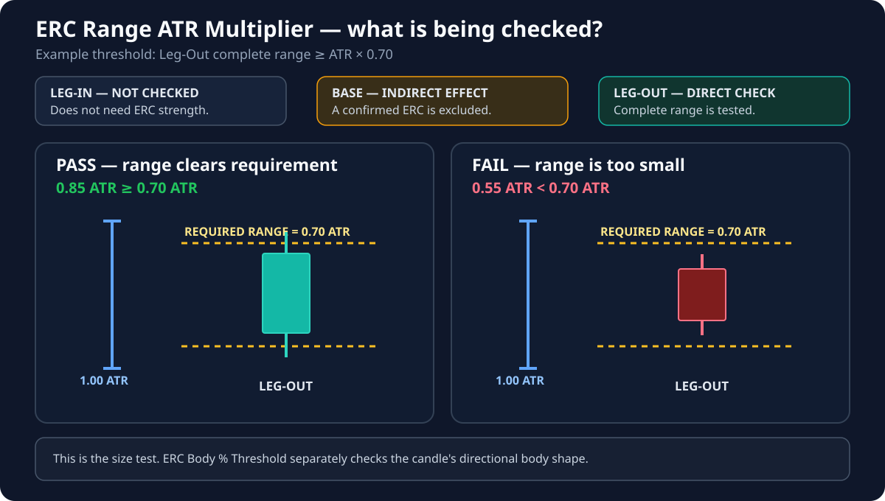

# ERC Range ATR Multiplier

**Default:** `0.70`

!!! info "Applies to: LEG-OUT + BASE"
    **LEG-OUT — direct effect:** this setting helps decide whether the departure is large enough to be an Extended Range Candle.

    **BASE — indirect effect:** a candle that becomes an Extended Range Candle cannot be accepted as part of the base.

    **LEG-IN — no effect:** the Leg-In does not need to pass the Extended Range Candle test.

## Terms used on this page

- **ERC — Extended Range Candle** — a decisive expansion candle with a meaningful body and enough size compared with recent market movement.
- **Candle range** — the complete distance from the candle's low to its high.
- **ATR** — a measure of how much price has typically moved over recent candles.
- **Leg-Out** — the departure candle that confirms price has left the base.

## What this setting controls

It controls how large a potential **Leg-Out** must be compared with recent market movement. At the default value of `0.70`, the complete candle must cover at least 70% of the current ATR reference.

This prevents an ordinary small candle from being treated as a meaningful departure simply because its body looks clean.

## If you lower the value

- Smaller departures can qualify.
- More zones may appear during quiet sessions.
- Ordinary market noise is more likely to be accepted.

## If you raise the value

- The departure must stand out more strongly from recent movement.
- Fewer zones qualify.
- Valid zones formed during low-volatility conditions may be missed.

## Important interaction

This setting checks candle size. **ERC Body % Threshold** separately checks whether the candle is directional rather than dominated by wicks. A valid expansion candle must pass both checks.

## Visual for this setting

The complete **Leg-Out** range is checked directly against the ATR-based requirement. The Base is affected only indirectly when a candle becomes an ERC; the Leg-In is not tested.
