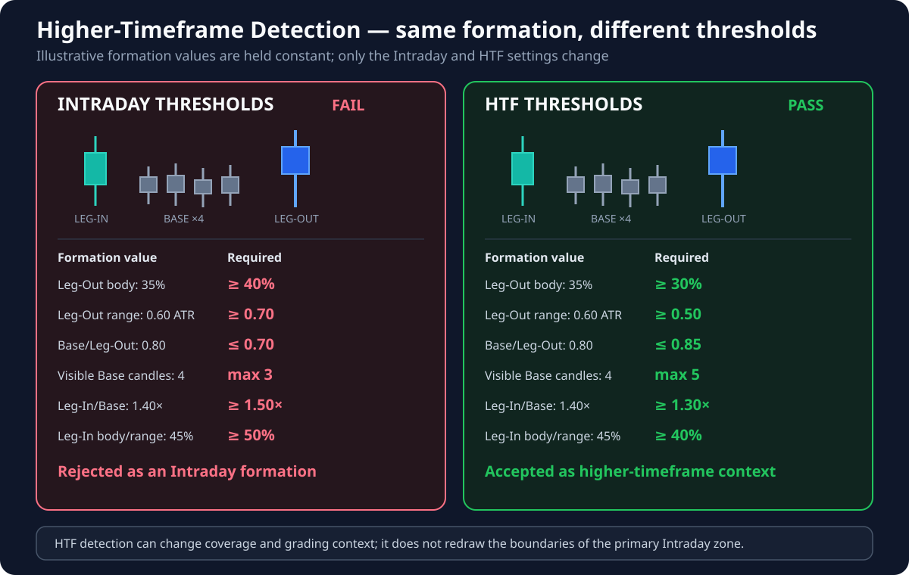

# Higher-Timeframe Detection

!!! info "Applies to: HTF LEG-OUT, BASE, and LEG-IN"
    These are higher-timeframe versions of the component settings. Each HTF input applies only to the formation component named in the table below. They do not change the primary Intraday formation directly.

## Terms used on this page

- **HTF — Higher Timeframe** — a broader chart interval used to provide market context.
- **Coverage** — confirmation that an Intraday zone overlaps a relevant higher-timeframe zone.
- **ERC — Extended Range Candle** — a decisive expansion candle with a meaningful body and enough size compared with recent market movement.
- **Base** — the compact pause before price departs.
- **Leg-In** — the approach into the base.
- **Leg-Out** — the departure away from the base.

## What this group controls

The Intraday indicator also searches for Supply and Demand zones on a broader timeframe. These zones do not replace the primary Intraday zones. They provide context and help show whether an Intraday setup is supported by a larger market structure.

The default HTF settings are deliberately more permissive because higher-timeframe candles often contain more internal price movement.

## Current defaults

| Parameter | Applies to | Default | Trader-facing meaning |
| --- | --- | ---: | --- |
| HTF Min. Leg-Out Body Size (% of Range) | **HTF LEG-OUT + BASE** | `30%` | Directly checks the departure body. Indirectly prevents an HTF Extended Range Candle from being used as a base candle. It does not qualify the Leg-In. |
| HTF Max. Base Body Size (% of Leg-Out) | **HTF BASE** | `85%` | Checks base bodies against the HTF Leg-Out body. It does not qualify the Leg-In. |
| HTF Min. Leg-Out Range (ATR ×) | **HTF LEG-OUT + BASE** | `0.50` | Directly checks departure size and indirectly affects base eligibility. It does not qualify the Leg-In. |
| HTF Max. Base Candles | **HTF BASE** | `6` | Leaves room for up to five actual HTF base candles before the Leg-In must be found. |
| HTF Min. Leg-In Body Size (× Largest Base Body) | **HTF LEG-IN** | `1.30` | Checks whether the HTF Leg-In is large enough compared with the biggest base body. |
| HTF Min. Leg-In Body Size (% of Range) | **HTF LEG-IN** | `40%` | Checks whether the HTF Leg-In body is large enough relative to its own candle range. |

## What traders will notice

- More permissive HTF settings produce more potential coverage zones.
- Stricter settings produce fewer but visually cleaner HTF zones.
- Changing HTF detection may alter coverage and zone grading without changing the boundaries of the primary Intraday zone.

## Visual for this group

The example keeps every candle value unchanged. It fails the stricter Intraday defaults but passes the more permissive HTF defaults, illustrating why higher-timeframe context can exist without changing the primary Intraday formation.
