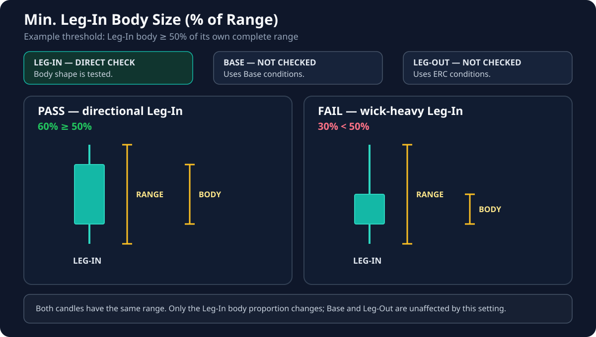

# Min. Leg-In Body Size (% of Range)

**Default:** `50%`

!!! info "Applies to: LEG-IN only"
    **LEG-IN — direct effect:** this setting decides whether the approach candle is directional enough.

    **BASE and LEG-OUT — no effect:** neither component is qualified by this setting.

## Terms used on this page

- **Leg-In** — the move that approaches the future zone area.
- **Body** — the solid part between the candle's open and close.
- **Wicks** — the thin parts above and below the body.
- **Candle range** — the complete distance from low to high.

## What this setting controls

It controls how directional the **Leg-In** candle must look. At the default value of `50`, at least half of the candle's complete range must be body.

## If you lower the value

- Leg-In candles with larger wicks can qualify.
- More formations may appear.
- Indecisive approaches are accepted more easily.

## If you raise the value

- The Leg-In must have a cleaner, larger body.
- Fewer formations qualify.
- Wick-heavy approaches are filtered out.

## Important distinction

This setting evaluates the shape of the Leg-In candle. **Min. Leg-In Body Size (× Largest Base Body)** separately checks whether the Leg-In is large enough compared with the base. The approach must pass both checks.

## Visual for this setting

Both examples have the same complete range. Only the **Leg-In** body proportion changes; the Base and Leg-Out are not checked by this parameter.
